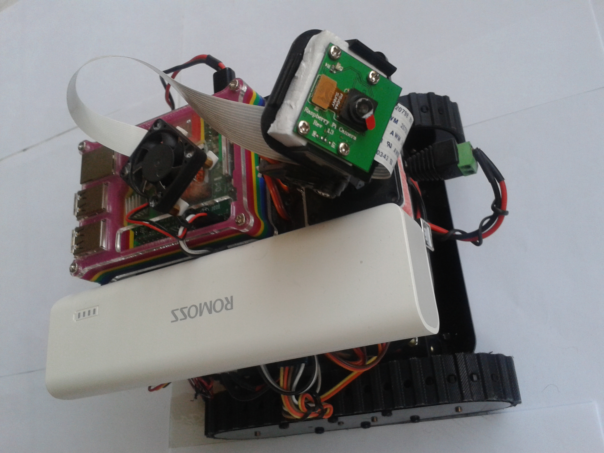
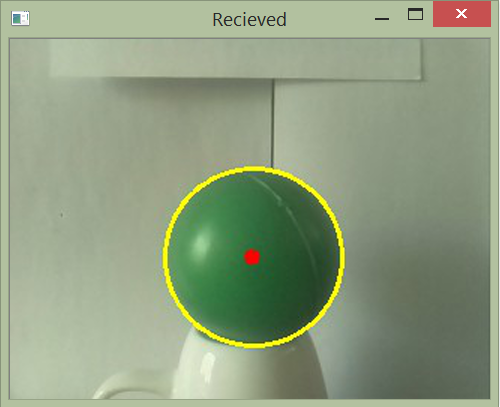

# Raspberry_Robot_Code

this is two code run on laptop & Raspberri pi (3) 
man for User on laptop 
and on_pi_... run on Rpi 
some file are icon & background & disconnect image 
one of them is harr-cascade xml 
and  testcv.cpp is a program that get image from webcam or pi camera (if use modeprobe bcm2835 -vl42 ...) and show frames 
Just that :D

  

  

